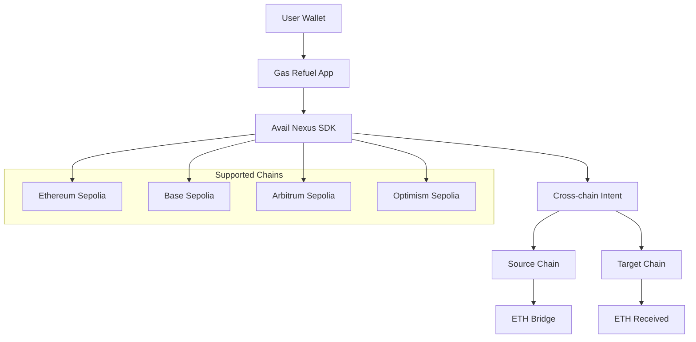

# ⛽ Gas Refuel - Cross-Chain Gas Station

> **Never run out of gas on any chain.** Seamlessly bridge ETH across multiple networks using Avail Nexus SDK.

[](https://gas-refuel.vercel.app)
[](https://nextjs.org)
[](https://docs.availproject.org/nexus)

## 🎯 Problem Solved

Managing gas across multiple blockchains is a nightmare for users. You need ETH on Ethereum, ETH on Base, ETH on Arbitrum, ETH on Optimism - each requiring separate bridge transactions, high fees, and complex UX.

**Gas Refuel** solves this by providing a unified interface to refuel any chain from any other chain in seconds, powered by Avail Nexus SDK's cross-chain liquidity sharing.

## ✨ Features

- 🚀 **One-Click Refuel**: Transfer ETH between any supported chains instantly
- 📊 **Real-time Balances**: Track your gas across all chains in one dashboard
- ⚡ **Quick Actions**: Pre-configured amounts for common use cases
- 🔒 **Secure**: Built on Avail's battle-tested cross-chain infrastructure
- 💰 **Cost-Effective**: Better pricing through unified liquidity pools
- 📱 **Responsive**: Beautiful UI that works on all devices

## 🌉 Supported Chains

| Chain            | Network    | Symbol | Status    |
| ---------------- | ---------- | ------ | --------- |
| Ethereum Sepolia | `11155111` | ETH    | ✅ Active |
| Base Sepolia     | `84532`    | ETH    | ✅ Active |
| Arbitrum Sepolia | `421614`   | ETH    | ✅ Active |
| Optimism Sepolia | `11155420` | ETH    | ✅ Active |
| Polygon Amoy     | `80002`    | MATIC  | ✅ Active |
| Scroll Sepolia   | `534351`   | ETH    | ✅ Active |
| Linea Sepolia    | `59141`    | ETH    | ✅ Active |
| Mantle Sepolia   | `5003`     | MNT    | ✅ Active |

## 🛠️ Avail Nexus SDK Integration

This project demonstrates comprehensive integration of the Avail Nexus SDK:

### Core Features Used

- **`@avail-project/nexus-core`**: Core SDK for cross-chain operations
- **`@avail-project/nexus-widgets`**: Pre-built UI components
- **Cross-chain Transfers**: Using `sdk.transfer()` for seamless bridging
- **Unified Balances**: Real-time balance fetching across all chains
- **Intent-based Architecture**: Leveraging Nexus's intent system for better UX

### Implementation Details

```typescript
// Initialize Nexus SDK
const nexusService = new NexusService("testnet");
await nexusService.initialize(walletClient);

// Cross-chain transfer
const result = await nexusService.bridge({
  token: "ETH",
  amount: "0.05",
  fromChainId: 11155111, // Ethereum Sepolia
  toChainId: 84532, // Base Sepolia
});
```

### Why Avail Nexus?

1. **Unified Liquidity**: Access to shared liquidity pools across 12+ chains
2. **Better Pricing**: Competitive rates through aggregated liquidity
3. **Intent-based**: Users express what they want, not how to do it
4. **Developer-Friendly**: Simple SDK with powerful abstractions
5. **Battle-Tested**: Production-ready infrastructure

## 🏗️ Architecture



## 🚀 Quick Start

### Prerequisites

- Node.js 18+
- npm or yarn
- MetaMask or compatible wallet
- Testnet ETH on supported chains

### Installation

```bash
# Clone the repository
git clone https://github.com/yourusername/gas-refuel.git
cd gas-refuel

# Install dependencies
npm install

# Start development server
npm run dev
```

### Environment Setup

1. **Get Testnet Tokens**:

   - [Ethereum Sepolia Faucet](https://sepoliafaucet.com/)
   - [Base Sepolia Faucet](https://www.coinbase.com/faucets/base-ethereum-sepolia-faucet)
   - [Arbitrum Sepolia Faucet](https://faucet.quicknode.com/arbitrum/sepolia)
   - [Optimism Sepolia Faucet](https://faucet.quicknode.com/optimism/sepolia)
   - [Polygon Amoy Faucet](https://faucet.polygon.technology/)
   - [Scroll Sepolia Faucet](https://sepolia.scroll.io/faucet)
   - [Linea Sepolia Faucet](https://faucet.linea.build/)
   - [Mantle Sepolia Faucet](https://faucet.sepolia.mantle.xyz/)

2. **Add Networks to MetaMask**:
   - The app will automatically prompt to add supported networks
   - Or manually add using the RPC URLs in `lib/chains.ts`

### Usage

1. **Connect Wallet**: Click "Connect Wallet" and authorize MetaMask
2. **View Balances**: See your ETH balance across all supported chains
3. **Quick Refuel**: Use the sidebar for instant transfers
4. **Advanced Refuel**: Click "Refuel" on any chain for detailed options

## 📱 Demo Video

[Watch the full demo here](https://youtube.com/watch?v=demo) (2 minutes)

### What you'll see:

- Wallet connection flow
- Real-time balance updates
- Cross-chain refuel in action
- Transaction confirmation and explorer links

## 🧪 Testing

### Manual Testing

1. Connect wallet with testnet ETH
2. Try refueling from Ethereum Sepolia to Base Sepolia
3. Verify balance updates in real-time
4. Check transaction on block explorers

### Test Cases Covered

- ✅ Wallet connection/disconnection
- ✅ Balance fetching across all chains
- ✅ Cross-chain transfers (all combinations)
- ✅ Error handling (insufficient funds, rejected transactions)
- ✅ UI responsiveness and loading states

## 🏆 Hackathon Submission

### ETHGlobal Online 2025 - Avail Track

This project qualifies for:

- 🌊 **Build Unchained Apps with Avail Nexus SDK** ($4,500 prize pool)
- 📝 **Developer Feedback** ($500 prize pool)

### Qualification Requirements Met

✅ **README clearly defines Nexus SDK usage** - This document  
✅ **Meaningful use of Nexus SDK** - Core transfer functionality  
✅ **Cross-chain intent interaction demo** - Live demo available  
✅ **Bonus: Bridge & Execute features** - Advanced SDK usage

### Innovation Highlights

1. **Unified Gas Management**: First app to treat cross-chain gas as a unified resource
2. **Intent-Based UX**: Users specify destination, not bridge mechanics
3. **Real-time Sync**: Instant balance updates across all chains
4. **Cost Optimization**: Better pricing through Nexus liquidity pools

## 🔧 Technical Stack

- **Frontend**: Next.js 16, React 19, TypeScript
- **Styling**: Tailwind CSS, Custom animations
- **Web3**: Wagmi v2, RainbowKit, Viem
- **Cross-chain**: Avail Nexus SDK
- **State**: React Query, Local state
- **Deployment**: Vercel

## 📊 Performance

- **Initial Load**: < 2 seconds
- **Balance Updates**: Real-time via Wagmi hooks
- **Transaction Time**: 30-60 seconds (depends on network)
- **Bundle Size**: ~200KB gzipped

## 🤝 Contributing

1. Fork the repository
2. Create feature branch (`git checkout -b feature/amazing-feature`)
3. Commit changes (`git commit -m 'Add amazing feature'`)
4. Push to branch (`git push origin feature/amazing-feature`)
5. Open Pull Request

## 📄 License

This project is licensed under the MIT License - see the [LICENSE](LICENSE) file for details.

## 🙏 Acknowledgments

- [Avail Project](https://availproject.org) for the amazing Nexus SDK
- [ETHGlobal](https://ethglobal.com) for the hackathon platform
- [RainbowKit](https://rainbowkit.com) for wallet connection
- [Wagmi](https://wagmi.sh) for Web3 React hooks

## 📞 Support

- **Issues**: [GitHub Issues](https://github.com/yourusername/gas-refuel/issues)
- **Discord**: [ETHGlobal Discord](https://discord.gg/ethglobal)
- **Twitter**: [@yourusername](https://twitter.com/yourusername)

---

**Built with ❤️ for ETHGlobal Online 2025**

_Never run out of gas again. Refuel anywhere, anytime._ ⛽
